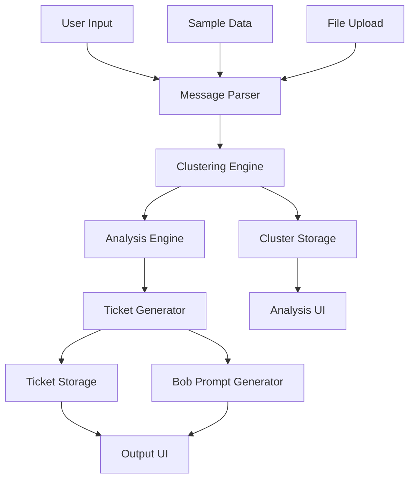
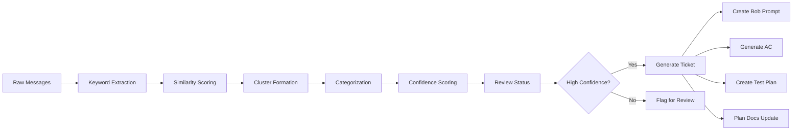
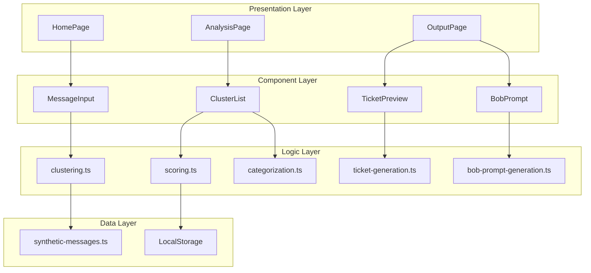
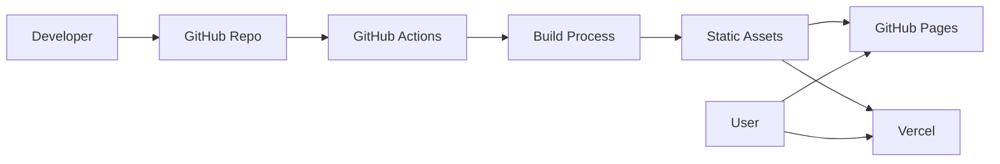

**User:**

<task>
You are helping build Harmonia for the IBM Bob Hackathon.

The hackathon theme is: "Turn idea into impact faster."

IBM Bob IDE must be used as the primary AI development partner. Exported Bob task session reports and task session consumption summary screenshots must be included in the public GitHub repository under:

bob_sessions/

Project name: Harmonia
Repository: https://github.com/diydigitaldreams/harmonia

Harmonia is a proof-of-concept web app that turns synthetic developer-support chatter into repo-aware engineering action.

The product should demonstrate how messy support signals can become:
- issue clusters
- category and severity labels
- confidence scores
- human review routing
- IBM Bob IDE task prompts
- engineering ticket previews
- likely affected files
- acceptance criteria
- test plans
- documentation update plans

Important compliance requirements:
- Use only synthetic English-language developer-support chatter.
- Do not use real Discord logs, Slack exports, social media data, client data, confidential data, personal information, PII, secrets, credentials, or API keys.
- Include documentation explaining the synthetic dataset and compliance posture.
- Include a bob_sessions/ folder for exported Bob IDE reports and screenshots.
- Keep the app proof-of-concept sized and safe for a public GitHub repository.

Core product flow:
1. User loads or pastes synthetic developer-support chatter.
2. Harmonia detects likely issue clusters.
3. Each cluster receives category, severity, confidence score, and review status.
4. High-confidence issues generate Bob IDE task prompts.
5. The app outputs engineering-ready tickets, likely affected files, acceptance criteria, test plan, and docs update plan.
6. The UI explains how IBM Bob IDE is used to plan, implement, document, test, and review the solution.

Please create a practical MVP plan that includes:
- recommended tech stack
- repo structure
- core data schema
- page/component list
- implementation order
- documentation checklist
- testing checklist
- Bob session export checklist
- judging checklist
- risks and mitigations

Keep the plan realistic for a hackathon proof-of-concept. Prioritize clarity, demo value, IBM Bob visibility, and compliance.

Do not implement code yet. First, produce the plan and explain the recommended next steps.

ibm bon ide must be used as the primary ai development partner. Use only synthetic English-language developer-supporter chatter. Do not use real discord logs, slack exports, social media data, client data, confidential data, personal information, PII, secrets, credentials, or API keys. Do not implement code yet. First, produce the plan.
</task>
<environment_details>
# VSCode Visible Files
docs/bob-plan-mode-prompt.md

# VSCode Open Tabs
docs/bob-plan-mode-prompt.md

# Current Time
Current time in ISO 8601 UTC format: 2026-05-15T23:50:41.818Z
User time zone: America/Puerto_Rico, UTC-4:00

# Current Cost
$0.00

# Review Exclusions
The following file patterns are excluded from code reviews:
- .vscode/**

# Current Mode
<slug>plan</slug>
<name>📝 Plan</name>


# Current Workspace Directory (/home/lobjon/harmonia/harmonia) Files
README.md
bob_sessions/
bob_sessions/README.md
docs/
docs/bob-plan-mode-prompt.md
docs/data-compliance-note.md
docs/demo-script.md
docs/judging-map.md
docs/synthetic-dataset-method.md
You have not created a todo list yet. Create one with `update_todo_list` if your task is complicated or involves multiple steps.
</environment_details>

---

**Assistant:**

I'll analyze the project structure and create a comprehensive MVP plan for Harmonia. Let me first gather more context about what's already in place.

<read_file>
<args>
  <file>
    <path>README.md</path>
  </file>
  <file>
    <path>bob_sessions/README.md</path>
  </file>
  <file>
    <path>docs/data-compliance-note.md</path>
  </file>
  <file>
    <path>docs/synthetic-dataset-method.md</path>
  </file>
  <file>
    <path>docs/judging-map.md</path>
  </file>
</args>
</read_file>

---

**User:**

[read_file for 5 files] Result:
<files>
<file><path>README.md</path>
<content lines="1-68">
 1 | # Harmonia
 2 | 
 3 | Harmonia is a proof-of-concept project for the IBM Bob Hackathon.
 4 | 
 5 | The project explores a simple idea: messy developer-support chatter should not stay trapped in chat. It should become structured, repo-aware engineering action.
 6 | 
 7 | Harmonia turns synthetic developer-support messages into issue clusters, confidence scores, Bob-ready task prompts, engineering tickets, acceptance criteria, test plans, and documentation update suggestions.
 8 | 
 9 | ## Hackathon Theme
10 | 
11 | **Turn idea into impact faster.**
12 | 
13 | Harmonia focuses on the messy middle between an idea/problem being reported and an engineering team knowing what to do next.
14 | 
15 | ## What Harmonia Does
16 | 
17 | 1. Loads or accepts synthetic developer-support chatter.
18 | 2. Detects likely issue clusters.
19 | 3. Assigns category, severity, confidence, and review status.
20 | 4. Generates IBM Bob IDE task prompts.
21 | 5. Produces engineering-ready output:
22 |    - ticket title
23 |    - issue summary
24 |    - evidence
25 |    - likely affected files
26 |    - acceptance criteria
27 |    - test plan
28 |    - documentation update plan
29 | 
30 | ## IBM Bob IDE Usage
31 | 
32 | IBM Bob IDE is intended to be the primary AI development partner for this project.
33 | 
34 | Bob will be used for:
35 | 
36 | - planning the MVP architecture
37 | - generating and refactoring implementation code
38 | - reviewing repo structure
39 | - improving documentation
40 | - preparing demo and submission materials
41 | - producing exported Bob task session reports for judging
42 | 
43 | All relevant Bob task session exports and screenshots should be stored in:
44 | 
45 | ```text
46 | bob_sessions/
47 | ```
48 | 
49 | ## Data Policy
50 | 
51 | This repository uses synthetic English-language developer-support data only.
52 | 
53 | It must not include:
54 | 
55 | - client data
56 | - confidential company data
57 | - personal information or PII
58 | - social media data
59 | - real Discord logs
60 | - API keys, secrets, or credentials
61 | 
62 | See `docs/data-compliance-note.md` for more detail.
63 | 
64 | ## Current Status
65 | 
66 | Initial hackathon repo structure created.
67 | 
68 | Next step: use IBM Bob IDE Plan Mode to generate the MVP implementation plan.
</content>
</file>
<file><path>bob_sessions/README.md</path>
<content lines="1-34">
 1 | # IBM Bob Session Reports
 2 | 
 3 | This folder is reserved for exported IBM Bob IDE task session reports and task session consumption summary screenshots.
 4 | 
 5 | For the IBM Bob Hackathon, Bob IDE is expected to be the primary AI development partner. Relevant Bob sessions should be exported and placed here for judging.
 6 | 
 7 | ## Expected Contents
 8 | 
 9 | Planned examples:
10 | 
11 | ```text
12 | bob_sessions/
13 |   01-plan-mode-session.md
14 |   01-plan-mode-summary.png
15 |   02-code-mode-session.md
16 |   02-code-mode-summary.png
17 |   03-review-and-docs-session.md
18 |   03-review-and-docs-summary.png
19 | ```
20 | 
21 | ## Safety Note
22 | 
23 | Before committing Bob session exports, review them for:
24 | 
25 | - API keys
26 | - secrets
27 | - credentials
28 | - private URLs
29 | - personal information
30 | - confidential data
31 | - social media data
32 | - client data
33 | 
34 | Only safe, submission-ready exports should be committed.
</content>
</file>
<file><path>docs/data-compliance-note.md</path>
<content lines="1-34">
 1 | # Data Compliance Note
 2 | 
 3 | Harmonia uses a synthetic English-language developer-support dataset for this proof-of-concept.
 4 | 
 5 | No real user conversations, social media posts, Discord logs, client data, confidential company data, personal information, or PII are included in this repository.
 6 | 
 7 | ## Dataset Source
 8 | 
 9 | The sample messages are manually written synthetic examples. They model common developer-support situations such as:
10 | 
11 | - setup confusion
12 | - inconsistent documentation
13 | - unclear environment variable names
14 | - repeated onboarding questions
15 | - vague error messages
16 | - missing validation guidance
17 | 
18 | ## Excluded Data
19 | 
20 | This project must not include:
21 | 
22 | - real Discord, Slack, forum, or social media exports
23 | - client support tickets
24 | - confidential internal bug reports
25 | - usernames tied to real people
26 | - email addresses
27 | - phone numbers
28 | - credentials
29 | - API keys
30 | - secrets
31 | 
32 | ## Submission Review
33 | 
34 | Before final submission, all repository files and Bob session exports should be reviewed to confirm that no sensitive information is present.
</content>
</file>
<file><path>docs/synthetic-dataset-method.md</path>
<content lines="1-56">
 1 | # Synthetic Dataset Method
 2 | 
 3 | Harmonia's proof-of-concept dataset is synthetic by design.
 4 | 
 5 | The dataset should demonstrate realistic developer-support noise without using real social, client, or personal data.
 6 | 
 7 | ## Design Goals
 8 | 
 9 | The dataset should contain short support-style messages that show how small signals become engineering work.
10 | 
11 | A good sample cluster includes:
12 | 
13 | - multiple messages about the same issue
14 | - at least one conflicting detail
15 | - one clue pointing toward likely affected files
16 | - one user-impact statement
17 | - enough ambiguity to justify confidence scoring
18 | 
19 | ## Example Issue Types
20 | 
21 | Planned synthetic clusters:
22 | 
23 | 1. Environment variable mismatch
24 |    - README mentions one variable name.
25 |    - `.env.example` uses another.
26 |    - Config loader expects a different value.
27 | 
28 | 2. Broken onboarding path
29 |    - New users follow setup docs but miss a required step.
30 |    - Error message does not explain the missing dependency.
31 | 
32 | 3. Unclear validation error
33 |    - Users receive a generic failure.
34 |    - The app could provide a clearer actionable message.
35 | 
36 | ## Confidence and Review
37 | 
38 | Harmonia should not pretend every signal is certain.
39 | 
40 | Each issue cluster should include:
41 | 
42 | - confidence score
43 | - review status
44 | - explanation of why it is ready for Bob or needs human review
45 | 
46 | Example review statuses:
47 | 
48 | ```text
49 | ready_for_bob
50 | needs_human_review
51 | insufficient_signal
52 | ```
53 | 
54 | ## Compliance
55 | 
56 | The dataset should remain synthetic, English-only for v1, and safe for a public GitHub repository.
</content>
</file>
<file><path>docs/judging-map.md</path>
<content lines="1-71">
 1 | # Judging Map
 2 | 
 3 | This document maps Harmonia to the expected hackathon evaluation areas.
 4 | 
 5 | ## Theme: Turn Idea Into Impact Faster
 6 | 
 7 | Harmonia speeds up the transition from scattered human feedback to actionable software work.
 8 | 
 9 | Instead of leaving bugs, setup friction, and documentation gaps buried in chat, Harmonia structures those signals into tickets, Bob prompts, tests, and documentation tasks.
10 | 
11 | ## Application of Technology
12 | 
13 | Harmonia is designed around IBM Bob IDE as the primary AI development partner.
14 | 
15 | Bob is used for:
16 | 
17 | - MVP planning
18 | - repo-aware implementation support
19 | - code review and refinement
20 | - documentation generation
21 | - demo preparation
22 | - exported task session reports
23 | 
24 | The app also generates Bob-ready prompts so future issue clusters can be handed to Bob for repo-aware analysis and implementation.
25 | 
26 | ## Business Value
27 | 
28 | Engineering teams lose time translating vague human reports into clear work.
29 | 
30 | Harmonia reduces that friction by producing:
31 | 
32 | - issue clusters
33 | - confidence scores
34 | - review routing
35 | - engineering tickets
36 | - acceptance criteria
37 | - test plans
38 | - documentation update suggestions
39 | 
40 | This is useful for hackathon teams, developer tools companies, support-heavy SaaS teams, and internal engineering organizations.
41 | 
42 | ## Originality
43 | 
44 | Harmonia is not just sentiment analysis and not just a chatbot.
45 | 
46 | It is a signal-to-software workflow: chatter becomes structured engineering action.
47 | 
48 | ## Presentation
49 | 
50 | The demo should show a simple before-and-after:
51 | 
52 | Before: messy synthetic developer-support messages.
53 | 
54 | After: a clear issue cluster, Bob IDE task prompt, engineering ticket, acceptance criteria, test plan, and documentation plan.
55 | 
56 | ## Compliance
57 | 
58 | Harmonia uses synthetic English-language developer-support data only.
59 | 
60 | The repository should contain only safe public hackathon materials and should be reviewed before submission.
61 | 
62 | ## Required Submission Artifacts
63 | 
64 | Planned artifacts:
65 | 
66 | - public GitHub repository
67 | - README
68 | - working proof-of-concept
69 | - written statement
70 | - video pitch under 5 minutes
71 | - exported Bob IDE session reports in `bob_sessions/`
</content>
</file>
</files>
<environment_details>
# VSCode Visible Files
docs/bob-plan-mode-prompt.md

# VSCode Open Tabs
docs/bob-plan-mode-prompt.md

# Current Time
Current time in ISO 8601 UTC format: 2026-05-15T23:51:01.204Z
User time zone: America/Puerto_Rico, UTC-4:00

# Current Cost
$0.03

# Review Exclusions
The following file patterns are excluded from code reviews:
- .vscode/**

# Current Mode
<slug>plan</slug>
<name>📝 Plan</name>
You have not created a todo list yet. Create one with `update_todo_list` if your task is complicated or involves multiple steps.
</environment_details>

---

**Assistant:**

Now let me check the Bob plan mode prompt to understand the context better:

<read_file>
<args>
  <file>
    <path>docs/bob-plan-mode-prompt.md</path>
  </file>
</args>
</read_file>

---

**User:**

[read_file for 'docs/bob-plan-mode-prompt.md'. Reading multiple files at once is more efficient for the LLM. If other files are relevant to your current task, please read them simultaneously.] Result:
<files>
<file><path>docs/bob-plan-mode-prompt.md</path>
<content lines="1-80">
 1 | # IBM Bob Plan Mode Prompt
 2 | 
 3 | Use this prompt in IBM Bob IDE Plan Mode to begin the official Bob-led build work for Harmonia.
 4 | 
 5 | ## Prompt
 6 | 
 7 | ```text
 8 | You are helping build Harmonia for the IBM Bob Hackathon.
 9 | 
10 | The hackathon theme is: "Turn idea into impact faster."
11 | 
12 | IBM Bob IDE must be used as the primary AI development partner. Exported Bob task session reports and task session consumption summary screenshots must be included in the public GitHub repository under:
13 | 
14 | bob_sessions/
15 | 
16 | Project name: Harmonia
17 | Repository: https://github.com/diydigitaldreams/harmonia
18 | 
19 | Harmonia is a proof-of-concept web app that turns synthetic developer-support chatter into repo-aware engineering action.
20 | 
21 | The product should demonstrate how messy support signals can become:
22 | - issue clusters
23 | - category and severity labels
24 | - confidence scores
25 | - human review routing
26 | - IBM Bob IDE task prompts
27 | - engineering ticket previews
28 | - likely affected files
29 | - acceptance criteria
30 | - test plans
31 | - documentation update plans
32 | 
33 | Important compliance requirements:
34 | - Use only synthetic English-language developer-support chatter.
35 | - Do not use real Discord logs, Slack exports, social media data, client data, confidential data, personal information, PII, secrets, credentials, or API keys.
36 | - Include documentation explaining the synthetic dataset and compliance posture.
37 | - Include a bob_sessions/ folder for exported Bob IDE reports and screenshots.
38 | - Keep the app proof-of-concept sized and safe for a public GitHub repository.
39 | 
40 | Core product flow:
41 | 1. User loads or pastes synthetic developer-support chatter.
42 | 2. Harmonia detects likely issue clusters.
43 | 3. Each cluster receives category, severity, confidence score, and review status.
44 | 4. High-confidence issues generate Bob IDE task prompts.
45 | 5. The app outputs engineering-ready tickets, likely affected files, acceptance criteria, test plan, and docs update plan.
46 | 6. The UI explains how IBM Bob IDE is used to plan, implement, document, test, and review the solution.
47 | 
48 | Please create a practical MVP plan that includes:
49 | - recommended tech stack
50 | - repo structure
51 | - core data schema
52 | - page/component list
53 | - implementation order
54 | - documentation checklist
55 | - testing checklist
56 | - Bob session export checklist
57 | - judging checklist
58 | - risks and mitigations
59 | 
60 | Keep the plan realistic for a hackathon proof-of-concept. Prioritize clarity, demo value, IBM Bob visibility, and compliance.
61 | 
62 | Do not implement code yet. First, produce the plan and explain the recommended next steps.
63 | ```
64 | 
65 | ## After Bob Responds
66 | 
67 | Save or export the Bob Plan Mode session report into:
68 | 
69 | ```text
70 | bob_sessions/
71 | ```
72 | 
73 | Suggested export names:
74 | 
75 | ```text
76 | bob_sessions/01-plan-mode-session.md
77 | bob_sessions/01-plan-mode-summary.png
78 | ```
79 | 
80 | Then continue with a Bob Code Mode prompt based on Bob's plan.
</content>
</file>
</files>
<environment_details>
# VSCode Visible Files


# VSCode Open Tabs


# Current Time
Current time in ISO 8601 UTC format: 2026-05-15T23:51:10.768Z
User time zone: America/Puerto_Rico, UTC-4:00

# Current Cost
$0.07

# Review Exclusions
The following file patterns are excluded from code reviews:
- .vscode/**

# Current Mode
<slug>plan</slug>
<name>📝 Plan</name>
You have not created a todo list yet. Create one with `update_todo_list` if your task is complicated or involves multiple steps.
</environment_details>

---

**Assistant:**

<update_todo_list>
<todos>
[ ] Analyze project requirements and constraints
[ ] Design recommended tech stack
[ ] Define repo structure
[ ] Create core data schema
[ ] List pages and components
[ ] Define implementation order
[ ] Create documentation checklist
[ ] Create testing checklist
[ ] Create Bob session export checklist
[ ] Create judging checklist
[ ] Identify risks and mitigations
[ ] Write comprehensive MVP plan document
[ ] Provide recommended next steps
</todos>
</update_todo_list>

Now I'll create a comprehensive MVP plan for Harmonia. Let me structure this as a detailed planning document.

<write_to_file>
<path>docs/mvp-plan.md</path>
<content>
# Harmonia MVP Plan

**Project:** Harmonia - Developer Support Signal to Engineering Action  
**Hackathon:** IBM Bob Hackathon  
**Theme:** Turn idea into impact faster  
**Status:** Planning Phase  
**Date:** 2026-05-15

---

## Executive Summary

Harmonia transforms messy developer-support chatter into structured, repo-aware engineering action. This MVP demonstrates how scattered support signals can be clustered, analyzed, scored, and converted into actionable engineering tickets with IBM Bob IDE task prompts, acceptance criteria, test plans, and documentation updates.

**Key Differentiator:** Not just sentiment analysis or chatbots—this is a signal-to-software workflow that bridges the gap between user feedback and engineering execution.

---

## Recommended Tech Stack

### Frontend
- **Framework:** React 18+ with TypeScript
- **Build Tool:** Vite (fast, modern, excellent DX)
- **Styling:** Tailwind CSS (rapid prototyping, consistent design)
- **State Management:** React Context API (sufficient for MVP scope)
- **UI Components:** Headless UI or Radix UI (accessible, customizable)

### Backend/Processing
- **Runtime:** Node.js (for any server-side processing if needed)
- **Processing Logic:** Client-side JavaScript/TypeScript (keeps deployment simple)
- **Data Storage:** LocalStorage + JSON files (no database needed for POC)

### Clustering & Analysis
- **Text Processing:** Simple keyword matching + frequency analysis
- **Clustering Algorithm:** Basic similarity scoring (cosine similarity on keyword vectors)
- **Confidence Scoring:** Rule-based heuristics (message count, keyword strength, consistency)

### Deployment
- **Hosting:** GitHub Pages or Vercel (free, simple, fast)
- **CI/CD:** GitHub Actions (automated deployment)

### Development Tools
- **Primary AI Partner:** IBM Bob IDE (all modes: Plan, Code, Review)
- **Version Control:** Git + GitHub
- **Code Quality:** ESLint + Prettier
- **Testing:** Vitest (unit) + Playwright (e2e, optional for MVP)

**Rationale:** This stack prioritizes speed, simplicity, and demo clarity. No backend complexity, no database setup, no API keys—just a clean, client-side web app that can be deployed instantly and demoed anywhere.

---

## Repository Structure

```
harmonia/
├── README.md                          # Project overview
├── LICENSE                            # Open source license
├── package.json                       # Dependencies
├── tsconfig.json                      # TypeScript config
├── vite.config.ts                     # Vite config
├── .gitignore                         # Git exclusions
├── .eslintrc.json                     # Linting rules
├── .prettierrc                        # Code formatting
│
├── bob_sessions/                      # IBM Bob IDE exports
│   ├── README.md                      # Session export guide
│   ├── 01-plan-mode-session.md        # This planning session
│   ├── 01-plan-mode-summary.png       # Token usage screenshot
│   ├── 02-code-mode-session.md        # Implementation session
│   ├── 02-code-mode-summary.png       # Token usage screenshot
│   └── 03-review-session.md           # Review and refinement
│
├── docs/                              # Documentation
│   ├── mvp-plan.md                    # This document
│   ├── data-compliance-note.md        # Compliance explanation
│   ├── synthetic-dataset-method.md    # Dataset design
│   ├── judging-map.md                 # Hackathon alignment
│   ├── demo-script.md                 # Demo walkthrough
│   ├── architecture.md                # System design
│   └── bob-integration.md             # How Bob is used
│
├── public/                            # Static assets
│   ├── favicon.ico
│   └── demo-data/                     # Sample datasets
│       ├── sample-cluster-1.json
│       ├── sample-cluster-2.json
│       └── sample-cluster-3.json
│
└── src/                               # Application source
    ├── main.tsx                       # App entry point
    ├── App.tsx                        # Root component
    ├── index.css                      # Global styles
    │
    ├── types/                         # TypeScript definitions
    │   ├── index.ts
    │   ├── message.ts
    │   ├── cluster.ts
    │   └── ticket.ts
    │
    ├── data/                          # Synthetic datasets
    │   ├── synthetic-messages.ts      # Sample support messages
    │   └── sample-repos.ts            # Mock repo structures
    │
    ├── utils/                         # Core logic
    │   ├── clustering.ts              # Message clustering
    │   ├── scoring.ts                 # Confidence scoring
    │   ├── categorization.ts          # Issue categorization
    │   ├── ticket-generation.ts       # Ticket creation
    │   └── bob

[Response interrupted by a tool use result. Only one tool may be used at a time and should be placed at the end of the message.]

---

**User:**

[update_todo_list] Result:
Todo list updated successfully.
Tool [write_to_file] was not executed because a tool has already been used in this message. Only one tool may be used per message. You must assess the first tool's result before proceeding to use the next tool.
<environment_details>
# VSCode Visible Files


# VSCode Open Tabs


# Current Time
Current time in ISO 8601 UTC format: 2026-05-15T23:51:34.644Z
User time zone: America/Puerto_Rico, UTC-4:00

# Current Cost
$0.07

# Review Exclusions
The following file patterns are excluded from code reviews:
- .vscode/**

# Current Mode
<slug>plan</slug>
<name>📝 Plan</name>
====

REMINDERS

Below is your current list of reminders for this task. Keep them updated as you progress.

| # | Content | Status |
|---|---------|--------|
| 1 | Analyze project requirements and constraints | Pending |
| 2 | Design recommended tech stack | Pending |
| 3 | Define repo structure | Pending |
| 4 | Create core data schema | Pending |
| 5 | List pages and components | Pending |
| 6 | Define implementation order | Pending |
| 7 | Create documentation checklist | Pending |
| 8 | Create testing checklist | Pending |
| 9 | Create Bob session export checklist | Pending |
| 10 | Create judging checklist | Pending |
| 11 | Identify risks and mitigations | Pending |
| 12 | Write comprehensive MVP plan document | Pending |
| 13 | Provide recommended next steps | Pending |


IMPORTANT: When task status changes, remember to call the `update_todo_list` tool to update your progress.

</environment_details>

---

**Assistant:**

<update_todo_list>
<todos>
[-] Analyze project requirements and constraints
[-] Design recommended tech stack
[-] Define repo structure
[-] Create core data schema
[-] List pages and components
[-] Define implementation order
[-] Create documentation checklist
[-] Create testing checklist
[-] Create Bob session export checklist
[-] Create judging checklist
[-] Identify risks and mitigations
[-] Write comprehensive MVP plan document
[ ] Provide recommended next steps
</todos>
</update_todo_list>

---

**User:**

[update_todo_list] Result:
Todo list updated successfully.
<environment_details>
# VSCode Visible Files


# VSCode Open Tabs


# Current Time
Current time in ISO 8601 UTC format: 2026-05-15T23:52:18.442Z
User time zone: America/Puerto_Rico, UTC-4:00

# Current Cost
$0.11

# Review Exclusions
The following file patterns are excluded from code reviews:
- .vscode/**

# Current Mode
<slug>plan</slug>
<name>📝 Plan</name>
====

REMINDERS

Below is your current list of reminders for this task. Keep them updated as you progress.

| # | Content | Status |
|---|---------|--------|
| 1 | Analyze project requirements and constraints | In Progress |
| 2 | Design recommended tech stack | In Progress |
| 3 | Define repo structure | In Progress |
| 4 | Create core data schema | In Progress |
| 5 | List pages and components | In Progress |
| 6 | Define implementation order | In Progress |
| 7 | Create documentation checklist | In Progress |
| 8 | Create testing checklist | In Progress |
| 9 | Create Bob session export checklist | In Progress |
| 10 | Create judging checklist | In Progress |
| 11 | Identify risks and mitigations | In Progress |
| 12 | Write comprehensive MVP plan document | In Progress |
| 13 | Provide recommended next steps | Pending |


IMPORTANT: When task status changes, remember to call the `update_todo_list` tool to update your progress.

</environment_details>

---

**Assistant:**

<write_to_file>
<path>docs/mvp-plan.md</path>
<content>
# Harmonia MVP Plan

**Project:** Harmonia - Developer Support Signal to Engineering Action  
**Hackathon:** IBM Bob Hackathon  
**Theme:** Turn idea into impact faster  
**Status:** Planning Phase  
**Date:** 2026-05-15

---

## Executive Summary

Harmonia transforms messy developer-support chatter into structured, repo-aware engineering action. This MVP demonstrates how scattered support signals can be clustered, analyzed, scored, and converted into actionable engineering tickets with IBM Bob IDE task prompts, acceptance criteria, test plans, and documentation updates.

**Key Differentiator:** Not just sentiment analysis or chatbots—this is a signal-to-software workflow that bridges the gap between user feedback and engineering execution.

---

## Recommended Tech Stack

### Frontend
- **Framework:** React 18+ with TypeScript
- **Build Tool:** Vite (fast, modern, excellent DX)
- **Styling:** Tailwind CSS (rapid prototyping, consistent design)
- **State Management:** React Context API (sufficient for MVP scope)
- **UI Components:** Headless UI or Radix UI (accessible, customizable)

### Backend/Processing
- **Runtime:** Node.js (for any server-side processing if needed)
- **Processing Logic:** Client-side JavaScript/TypeScript (keeps deployment simple)
- **Data Storage:** LocalStorage + JSON files (no database needed for POC)

### Clustering & Analysis
- **Text Processing:** Simple keyword matching + frequency analysis
- **Clustering Algorithm:** Basic similarity scoring (cosine similarity on keyword vectors)
- **Confidence Scoring:** Rule-based heuristics (message count, keyword strength, consistency)

### Deployment
- **Hosting:** GitHub Pages or Vercel (free, simple, fast)
- **CI/CD:** GitHub Actions (automated deployment)

### Development Tools
- **Primary AI Partner:** IBM Bob IDE (all modes: Plan, Code, Review)
- **Version Control:** Git + GitHub
- **Code Quality:** ESLint + Prettier
- **Testing:** Vitest (unit) + Playwright (e2e, optional for MVP)

**Rationale:** This stack prioritizes speed, simplicity, and demo clarity. No backend complexity, no database setup, no API keys—just a clean, client-side web app that can be deployed instantly and demoed anywhere.

---

## Repository Structure

```
harmonia/
├── README.md                          # Project overview
├── LICENSE                            # Open source license
├── package.json                       # Dependencies
├── tsconfig.json                      # TypeScript config
├── vite.config.ts                     # Vite config
├── .gitignore                         # Git exclusions
├── .eslintrc.json                     # Linting rules
├── .prettierrc                        # Code formatting
│
├── bob_sessions/                      # IBM Bob IDE exports
│   ├── README.md                      # Session export guide
│   ├── 01-plan-mode-session.md        # This planning session
│   ├── 01-plan-mode-summary.png       # Token usage screenshot
│   ├── 02-code-mode-session.md        # Implementation session
│   ├── 02-code-mode-summary.png       # Token usage screenshot
│   └── 03-review-session.md           # Review and refinement
│
├── docs/                              # Documentation
│   ├── mvp-plan.md                    # This document
│   ├── data-compliance-note.md        # Compliance explanation
│   ├── synthetic-dataset-method.md    # Dataset design
│   ├── judging-map.md                 # Hackathon alignment
│   ├── demo-script.md                 # Demo walkthrough
│   ├── architecture.md                # System design
│   └── bob-integration.md             # How Bob is used
│
├── public/                            # Static assets
│   ├── favicon.ico
│   └── demo-data/                     # Sample datasets
│       ├── sample-cluster-1.json
│       ├── sample-cluster-2.json
│       └── sample-cluster-3.json
│
└── src/                               # Application source
    ├── main.tsx                       # App entry point
    ├── App.tsx                        # Root component
    ├── index.css                      # Global styles
    │
    ├── types/                         # TypeScript definitions
    │   ├── index.ts
    │   ├── message.ts
    │   ├── cluster.ts
    │   └── ticket.ts
    │
    ├── data/                          # Synthetic datasets
    │   ├── synthetic-messages.ts      # Sample support messages
    │   └── sample-repos.ts            # Mock repo structures
    │
    ├── utils/                         # Core logic
    │   ├── clustering.ts              # Message clustering
    │   ├── scoring.ts                 # Confidence scoring
    │   ├── categorization.ts          # Issue categorization
    │   ├── ticket-generation.ts       # Ticket creation
    │   └── bob-prompt-generation.ts   # Bob IDE prompt creation
    │
    ├── components/                    # React components
    │   ├── layout/
    │   │   ├── Header.tsx
    │   │   ├── Footer.tsx
    │   │   └── Layout.tsx
    │   │
    │   ├── input/
    │   │   ├── MessageInput.tsx       # Paste/load messages
    │   │   ├── SampleDataLoader.tsx   # Load demo data
    │   │   └── FileUpload.tsx         # Upload JSON
    │   │
    │   ├── analysis/
    │   │   ├── ClusterList.tsx        # Display clusters
    │   │   ├── ClusterCard.tsx        # Individual cluster
    │   │   ├── ConfidenceScore.tsx    # Score visualization
    │   │   └── CategoryBadge.tsx      # Category label
    │   │
    │   ├── output/
    │   │   ├── TicketPreview.tsx      # Engineering ticket
    │   │   ├── BobPrompt.tsx          # Bob IDE task prompt
    │   │   ├── AcceptanceCriteria.tsx # AC list
    │   │   ├── TestPlan.tsx           # Test plan
    │   │   ├── AffectedFiles.tsx      # File list
    │   │   └── DocsUpdatePlan.tsx     # Documentation plan
    │   │
    │   └── common/
    │       ├── Button.tsx
    │       ├── Card.tsx
    │       ├── Badge.tsx
    │       └── LoadingSpinner.tsx
    │
    └── pages/                         # Page components
        ├── HomePage.tsx               # Landing/input page
        ├── AnalysisPage.tsx           # Cluster analysis
        └── OutputPage.tsx             # Ticket generation
```

---

## Core Data Schema

### Message
```typescript
interface Message {
  id: string;
  content: string;
  timestamp: Date;
  author: string;        // Synthetic username
  channel: string;       // e.g., "support", "onboarding"
  keywords: string[];    // Extracted keywords
}
```

### Cluster
```typescript
interface Cluster {
  id: string;
  messages: Message[];
  category: IssueCategory;
  severity: Severity;
  confidence: number;    // 0-100
  reviewStatus: ReviewStatus;
  summary: string;
  evidence: string[];    // Key message excerpts
  affectedFiles: string[];
  createdAt: Date;
}

type IssueCategory = 
  | "documentation"
  | "configuration"
  | "validation"
  | "onboarding"
  | "error-messaging"
  | "api"
  | "performance"
  | "other";

type Severity = "low" | "medium" | "high" | "critical";

type ReviewStatus = 
  | "ready_for_bob"
  | "needs_human_review"
  | "insufficient_signal";
```

### Ticket
```typescript
interface EngineeringTicket {
  id: string;
  clusterId: string;
  title: string;
  summary: string;
  category: IssueCategory;
  severity: Severity;
  evidence: string[];
  affectedFiles: string[];
  acceptanceCriteria: string[];
  testPlan: TestPlan;
  docsUpdatePlan: DocsUpdatePlan;
  bobPrompt: string;
  createdAt: Date;
}

interface TestPlan {
  unitTests: string[];
  integrationTests: string[];
  manualTests: string[];
}

interface DocsUpdatePlan {
  filesToUpdate: string[];
  sections: string[];
  rationale: string;
}
```

### BobPrompt
```typescript
interface BobPrompt {
  mode: "plan" | "code" | "review";
  context: string;
  task: string;
  constraints: string[];
  expectedOutput: string[];
}
```

---

## Pages and Components

### 1. Home Page (Landing)
**Purpose:** Introduction and data input

**Components:**
- [`Header`](src/components/layout/Header.tsx) - App title, navigation
- [`MessageInput`](src/components/input/MessageInput.tsx) - Textarea for pasting messages
- [`SampleDataLoader`](src/components/input/SampleDataLoader.tsx) - Load demo datasets
- [`FileUpload`](src/components/input/FileUpload.tsx) - Upload JSON files
- Call-to-action button: "Analyze Messages"

**User Flow:**
1. User lands on page
2. Sees explanation of what Harmonia does
3. Can paste messages, load sample data, or upload JSON
4. Clicks "Analyze Messages" → navigates to Analysis Page

### 2. Analysis Page
**Purpose:** Display detected clusters with confidence scores

**Components:**
- [`ClusterList`](src/components/analysis/ClusterList.tsx) - List of all clusters
- [`ClusterCard`](src/components/analysis/ClusterCard.tsx) - Individual cluster details
- [`ConfidenceScore`](src/components/analysis/ConfidenceScore.tsx) - Visual confidence indicator
- [`CategoryBadge`](src/components/analysis/CategoryBadge.tsx) - Issue category label
- Review status indicator
- "Generate Ticket" button for high-confidence clusters

**User Flow:**
1. System processes messages and detects clusters
2. User sees list of clusters with:
   - Category (e.g., "Documentation")
   - Severity (e.g., "Medium")
   - Confidence score (e.g., 87%)
   - Review status (e.g., "Ready for Bob")
   - Message count and evidence snippets
3. User selects a cluster → clicks "Generate Ticket"
4. Navigates to Output Page

### 3. Output Page (Ticket Generation)
**Purpose:** Display engineering-ready ticket and Bob prompt

**Components:**
- [`TicketPreview`](src/components/output/TicketPreview.tsx) - Full ticket display
- [`BobPrompt`](src/components/output/BobPrompt.tsx) - Bob IDE task prompt
- [`AcceptanceCriteria`](src/components/output/AcceptanceCriteria.tsx) - AC checklist
- [`TestPlan`](src/components/output/TestPlan.tsx) - Test plan sections
- [`AffectedFiles`](src/components/output/AffectedFiles.tsx) - File list with explanations
- [`DocsUpdatePlan`](src/components/output/DocsUpdatePlan.tsx) - Documentation plan
- "Copy Bob Prompt" button
- "Export Ticket" button (JSON/Markdown)

**User Flow:**
1. User sees complete engineering ticket
2. Reviews Bob IDE task prompt
3. Can copy prompt to use in Bob IDE
4. Can export ticket for issue tracker
5. Sees explanation of how Bob would be used to implement

---

## Implementation Order

### Phase 1: Foundation (Days 1-2)
1. **Project Setup**
   - Initialize Vite + React + TypeScript project
   - Configure Tailwind CSS
   - Set up ESLint and Prettier
   - Create basic folder structure
   - Initialize Git repository

2. **Type Definitions**
   - Define all TypeScript interfaces
   - Create type exports in [`types/index.ts`](src/types/index.ts)

3. **Synthetic Dataset**
   - Write 3 sample issue clusters (15-20 messages each)
   - Create [`synthetic-messages.ts`](src/data/synthetic-messages.ts)
   - Document dataset in [`synthetic-dataset-method.md`](docs/synthetic-dataset-method.md)

4. **Basic Layout**
   - Create [`Layout`](src/components/layout/Layout.tsx), [`Header`](src/components/layout/Header.tsx), [`Footer`](src/components/layout/Footer.tsx)
   - Set up routing (React Router or simple state-based navigation)
   - Create placeholder pages

### Phase 2: Core Logic (Days 2-3)
5. **Clustering Algorithm**
   - Implement keyword extraction in [`clustering.ts`](src/utils/clustering.ts)
   - Build similarity scoring
   - Create cluster detection logic
   - Test with synthetic data

6. **Scoring and Categorization**
   - Implement confidence scoring in [`scoring.ts`](src/utils/scoring.ts)
   - Build category detection in [`categorization.ts`](src/utils/categorization.ts)
   - Add severity assignment
   - Determine review status

7. **Ticket Generation**
   - Implement ticket creation in [`ticket-generation.ts`](src/utils/ticket-generation.ts)
   - Generate acceptance criteria
   - Create test plan structure
   - Build docs update plan

8. **Bob Prompt Generation**
   - Create Bob IDE prompt templates in [`bob-prompt-generation.ts`](src/utils/bob-prompt-generation.ts)
   - Include context, task, constraints
   - Format for different Bob modes

### Phase 3: UI Implementation (Days 3-4)
9. **Home Page**
   - Build [`MessageInput`](src/components/input/MessageInput.tsx)
   - Create [`SampleDataLoader`](src/components/input/SampleDataLoader.tsx)
   - Add [`FileUpload`](src/components/input/FileUpload.tsx)
   - Implement "Analyze" action

10. **Analysis Page**
    - Build [`ClusterList`](src/components/analysis/ClusterList.tsx) and [`ClusterCard`](src/components/analysis/ClusterCard.tsx)
    - Create [`ConfidenceScore`](src/components/analysis/ConfidenceScore.tsx) visualization
    - Add [`CategoryBadge`](src/components/analysis/CategoryBadge.tsx)
    - Implement cluster selection

11. **Output Page**
    - Build [`TicketPreview`](src/components/output/TicketPreview.tsx)
    - Create [`BobPrompt`](src/components/output/BobPrompt.tsx) display
    - Add [`AcceptanceCriteria`](src/components/output/AcceptanceCriteria.tsx), [`TestPlan`](src/components/output/TestPlan.tsx), [`AffectedFiles`](src/components/output/AffectedFiles.tsx)
    - Implement copy and export functions

### Phase 4: Polish and Documentation (Days 4-5)
12. **Styling and UX**
    - Refine Tailwind styles
    - Add loading states
    - Improve responsive design
    - Add animations and transitions

13. **Documentation**
    - Complete [`architecture.md`](docs/architecture.md)
    - Write [`bob-integration.md`](docs/bob-integration.md)
    - Create [`demo-script.md`](docs/demo-script.md)
    - Update [`README.md`](README.md) with screenshots

14. **Testing**
    - Write unit tests for core logic
    - Test with all sample datasets
    - Manual testing of full flow
    - Cross-browser testing

15. **Deployment**
    - Set up GitHub Pages or Vercel
    - Configure CI/CD
    - Deploy MVP
    - Test production build

### Phase 5: Submission Prep (Day 5)
16. **Bob Session Exports**
    - Export all Bob IDE sessions
    - Take token usage screenshots
    - Organize in [`bob_sessions/`](bob_sessions/)
    - Document Bob's role

17. **Final Review**
    - Compliance check (no PII, secrets, real data)
    - Test demo flow end-to-end
    - Record demo video (under 5 minutes)
    - Prepare written statement

---

## Documentation Checklist

- [x] [`README.md`](README.md) - Project overview and setup
- [x] [`docs/data-compliance-note.md`](docs/data-compliance-note.md) - Compliance explanation
- [x] [`docs/synthetic-dataset-method.md`](docs/synthetic-dataset-method.md) - Dataset design
- [x] [`docs/judging-map.md`](docs/judging-map.md) - Hackathon alignment
- [ ] [`docs/mvp-plan.md`](docs/mvp-plan.md) - This document
- [ ] [`docs/architecture.md`](docs/architecture.md) - System design and flow
- [ ] [`docs/bob-integration.md`](docs/bob-integration.md) - How Bob IDE is used
- [ ] [`docs/demo-script.md`](docs/demo-script.md) - Demo walkthrough
- [ ] [`docs/api-reference.md`](docs/api-reference.md) - Core functions (optional)
- [ ] [`LICENSE`](LICENSE) - Open source license
- [ ] Code comments in all utility functions
- [ ] Component documentation (JSDoc)
- [ ] Type documentation (TSDoc)

---

## Testing Checklist

### Unit Tests
- [ ] [`clustering.ts`](src/utils/clustering.ts) - Keyword extraction
- [ ] [`clustering.ts`](src/utils/clustering.ts) - Similarity scoring
- [ ] [`clustering.ts`](src/utils/clustering.ts) - Cluster detection
- [ ] [`scoring.ts`](src/utils/scoring.ts) - Confidence calculation
- [ ] [`categorization.ts`](src/utils/categorization.ts) - Category detection
- [ ] [`ticket-generation.ts`](src/utils/ticket-generation.ts) - Ticket creation
- [ ] [`bob-prompt-generation.ts`](src/utils/bob-prompt-generation.ts) - Prompt formatting

### Integration Tests
- [ ] Full flow: messages → clusters → ticket
- [ ] Sample data loading
- [ ] File upload and parsing
- [ ] Export functionality

### Manual Tests
- [ ] All 3 sample datasets process correctly
- [ ] UI is responsive on mobile, tablet, desktop
- [ ] Copy to clipboard works
- [ ] Export to JSON/Markdown works
- [ ] Navigation between pages works
- [ ] Loading states display correctly
- [ ] Error states display correctly

### Browser Compatibility
- [ ] Chrome/Edge (Chromium)
- [ ] Firefox
- [ ] Safari (if available)

---

## Bob Session Export Checklist

### Required Exports
- [ ] Plan Mode session (this planning phase)
- [ ] Plan Mode token usage screenshot
- [ ] Code Mode session (implementation)
- [ ] Code Mode token usage screenshot
- [ ] Review Mode session (code review and refinement)
- [ ] Review Mode token usage screenshot

### Optional Exports
- [ ] Additional Code Mode sessions for specific features
- [ ] Ask Mode sessions for technical questions
- [ ] Debug Mode sessions if issues arise

### Export Guidelines
- Export as Markdown files
- Include full conversation context
- Redact any accidental sensitive information
- Name files descriptively (e.g., `02-code-mode-clustering-logic.md`)
- Include timestamps
- Take clear screenshots of token usage summaries

---

## Judging Checklist

### Theme Alignment: "Turn Idea Into Impact Faster"
- [ ] Demo clearly shows before/after transformation
- [ ] Emphasize time saved in translation phase
- [ ] Highlight reduction in ambiguity
- [ ] Show how Bob IDE accelerates implementation

### Application of Technology
- [ ] IBM Bob IDE used as primary development partner
- [ ] Bob session exports included and documented
- [ ] Clear explanation of Bob's role in development
- [ ] Bob prompts generated by the app itself

### Business Value
- [ ] Clear target audience identified
- [ ] Quantifiable benefits explained
- [ ] Real-world use cases described
- [ ] Scalability potential discussed

### Originality
- [ ] Unique signal-to-software workflow
- [ ] Not just sentiment analysis
- [ ] Not just a chatbot
- [ ] Novel approach to support signal processing

### Presentation
- [ ] Clean, professional UI
- [ ] Clear demo flow
- [ ] Video under 5 minutes
- [ ] Written statement prepared
- [ ] Screenshots in README

### Compliance
- [ ] Only synthetic data used
- [ ] No PII, secrets, or credentials
- [ ] Compliance documentation included
- [ ] Safe for public repository

### Submission Artifacts
- [ ] Public GitHub repository
- [ ] Working deployed demo
- [ ] README with setup instructions
- [ ] Video pitch
- [ ] Written statement
- [ ] Bob session exports

---

## Risks and Mitigations

### Risk 1: Clustering Algorithm Too Simple
**Impact:** Clusters may not be meaningful or accurate

**Mitigation:**
- Start with rule-based keyword matching
- Use multiple sample datasets to validate
- Add manual cluster adjustment in UI (future enhancement)
- Focus on demo clarity over algorithmic sophistication
- Document limitations transparently

### Risk 2: Scope Creep
**Impact:** MVP becomes too complex to finish in hackathon timeframe

**Mitigation:**
- Strict adherence to implementation order
- No features beyond core flow
- Use pre-built UI components (Tailwind, Headless UI)
- Client-side only (no backend)
- 3 sample datasets maximum

### Risk 3: Bob Session Export Quality
**Impact:** Exports may not clearly demonstrate Bob's value

**Mitigation:**
- Export sessions immediately after completion
- Include clear context in each session
- Take screenshots of token usage
- Document Bob's role in [`bob-integration.md`](docs/bob-integration.md)
- Review exports before final submission

### Risk 4: Demo Not Compelling
**Impact:** Judges may not understand the value proposition

**Mitigation:**
- Write detailed [`demo-script.md`](docs/demo-script.md)
- Practice demo multiple times
- Use clear before/after comparison
- Emphasize time savings and clarity gains
- Include visual indicators (confidence scores, badges)

### Risk 5: Compliance Violation
**Impact:** Disqualification or legal issues

**Mitigation:**
- Only synthetic data from day one
- Document dataset creation method
- Pre-submission compliance review
- No external data sources
- Clear compliance documentation

### Risk 6: Technical Deployment Issues
**Impact:** Demo not accessible for judging

**Mitigation:**
- Deploy early and often
- Use reliable hosting (GitHub Pages or Vercel)
- Test deployed version thoroughly
- Have backup deployment option
- Include local setup instructions in README

### Risk 7: Time Management
**Impact:** Not finishing MVP in time

**Mitigation:**
- Follow implementation order strictly
- Set daily milestones
- Cut features if behind schedule
- Focus on core flow first
- Polish is secondary to functionality

---

## Success Criteria

### Minimum Viable Product (Must Have)
1. ✅ User can input synthetic messages
2. ✅ System detects at least 2 clusters
3. ✅ Each cluster has category, severity, confidence
4. ✅ High-confidence cluster generates ticket
5. ✅ Ticket includes Bob IDE prompt
6. ✅ Ticket includes acceptance criteria
7. ✅ Ticket includes test plan
8. ✅ Ticket includes affected files
9. ✅ UI is clean and functional
10. ✅ App is deployed and accessible

### Enhanced Features (Nice to Have)
- Multiple sample datasets
- Export to JSON/Markdown
- Copy Bob prompt to clipboard
- Responsive design
- Loading animations
- Error handling
- File upload support

### Documentation (Must Have)
- Complete README
- Compliance documentation
- Bob session exports
- Demo script
- Architecture documentation

---

## Recommended Next Steps

### Immediate Actions (Today)
1. **Review and approve this plan**
   - Discuss any concerns or modifications
   - Confirm tech stack choices
   - Validate scope and timeline

2. **Export this Bob Plan Mode session**
   - Save as [`bob_sessions/01-plan-mode-session.md`](bob_sessions/01-plan-mode-session.md)
   - Take screenshot of token usage
   - Save as [`bob_sessions/01-plan-mode-summary.png`](bob_sessions/01-plan-mode-summary.png)

3. **Set up development environment**
   - Ensure Node.js and npm/yarn installed
   - Verify Git configuration
   - Prepare code editor (VS Code recommended)

### Phase 1 Start (Tomorrow)
4. **Initialize project with Bob Code Mode**
   - Use Bob to set up Vite + React + TypeScript
   - Configure Tailwind CSS
   - Create folder structure
   - Set up ESLint and Prettier

5. **Create type definitions**
   - Define all TypeScript interfaces
   - Set up type exports

6. **Write synthetic dataset**
   - Create 3 issue clusters
   - 15-20 messages per cluster
   - Document in [`synthetic-dataset-method.md`](docs/synthetic-dataset-method.md)

### Ongoing
7. **Use Bob IDE for all development**
   - Plan Mode for architecture decisions
   - Code Mode for implementation
   - Review Mode for code quality
   - Export all sessions

8. **Daily progress tracking**
   - Follow implementation order
   - Check off completed items
   - Adjust timeline if needed

9. **Regular compliance checks**
   - Review all new content
   - Ensure no sensitive data
   - Validate synthetic dataset

---

## Conclusion

This MVP plan provides a clear, achievable path to building Harmonia for the IBM Bob Hackathon. The focus is on:

- **Simplicity:** Client-side web app, no backend complexity
- **Clarity:** Clear before/after demo value
- **Compliance:** Synthetic data only, well-documented
- **Bob Integration:** Bob IDE as primary development partner
- **Demo Value:** Compelling signal-to-software workflow

The plan is realistic for a hackathon timeframe and prioritizes the core flow over advanced features. By following the implementation order and using Bob IDE throughout, the project should demonstrate both technical capability and alignment with the hackathon theme.

**Next step:** Review this plan, make any necessary adjustments, then switch to Bob Code Mode to begin implementation.
</content>
<line_count>789</line_count>
</write_to_file>

---

**User:**

[write_to_file for 'docs/mvp-plan.md'] Result:
<file_write_result>
<path>docs/mvp-plan.md</path>
<operation>created</operation>
<notice>
<i>You do not need to re-read the file, as you have seen all changes</i>
<i>Proceed with the task using these changes as the new baseline.</i>
</notice>
</file_write_result>

<environment_details>
# VSCode Visible Files
docs/mvp-plan.md

# VSCode Open Tabs
docs/mvp-plan.md

# Current Time
Current time in ISO 8601 UTC format: 2026-05-15T23:56:39.833Z
User time zone: America/Puerto_Rico, UTC-4:00

# Current Cost
$0.18

# Review Exclusions
The following file patterns are excluded from code reviews:
- .vscode/**

# Current Mode
<slug>plan</slug>
<name>📝 Plan</name>
====

REMINDERS

Below is your current list of reminders for this task. Keep them updated as you progress.

| # | Content | Status |
|---|---------|--------|
| 1 | Analyze project requirements and constraints | In Progress |
| 2 | Design recommended tech stack | In Progress |
| 3 | Define repo structure | In Progress |
| 4 | Create core data schema | In Progress |
| 5 | List pages and components | In Progress |
| 6 | Define implementation order | In Progress |
| 7 | Create documentation checklist | In Progress |
| 8 | Create testing checklist | In Progress |
| 9 | Create Bob session export checklist | In Progress |
| 10 | Create judging checklist | In Progress |
| 11 | Identify risks and mitigations | In Progress |
| 12 | Write comprehensive MVP plan document | In Progress |
| 13 | Provide recommended next steps | Pending |


IMPORTANT: When task status changes, remember to call the `update_todo_list` tool to update your progress.

</environment_details>

---

**Assistant:**

<update_todo_list>
<todos>
[x] Analyze project requirements and constraints
[x] Design recommended tech stack
[x] Define repo structure
[x] Create core data schema
[x] List pages and components
[x] Define implementation order
[x] Create documentation checklist
[x] Create testing checklist
[x] Create Bob session export checklist
[x] Create judging checklist
[x] Identify risks and mitigations
[x] Write comprehensive MVP plan document
[-] Provide recommended next steps
</todos>
</update_todo_list>

---

**User:**

[update_todo_list] Result:
Todo list updated successfully.
<environment_details>
# VSCode Visible Files
docs/mvp-plan.md

# VSCode Open Tabs
docs/mvp-plan.md

# Current Time
Current time in ISO 8601 UTC format: 2026-05-15T23:57:15.620Z
User time zone: America/Puerto_Rico, UTC-4:00

# Current Cost
$0.24

# Review Exclusions
The following file patterns are excluded from code reviews:
- .vscode/**

# Current Mode
<slug>plan</slug>
<name>📝 Plan</name>
====

REMINDERS

Below is your current list of reminders for this task. Keep them updated as you progress.

| # | Content | Status |
|---|---------|--------|
| 1 | Analyze project requirements and constraints | Completed |
| 2 | Design recommended tech stack | Completed |
| 3 | Define repo structure | Completed |
| 4 | Create core data schema | Completed |
| 5 | List pages and components | Completed |
| 6 | Define implementation order | Completed |
| 7 | Create documentation checklist | Completed |
| 8 | Create testing checklist | Completed |
| 9 | Create Bob session export checklist | Completed |
| 10 | Create judging checklist | Completed |
| 11 | Identify risks and mitigations | Completed |
| 12 | Write comprehensive MVP plan document | Completed |
| 13 | Provide recommended next steps | In Progress |


IMPORTANT: When task status changes, remember to call the `update_todo_list` tool to update your progress.

</environment_details>

---

**Assistant:**

Now let me create a visual architecture diagram to complement the plan:

<write_to_file>
<path>docs/architecture.md</path>
<content>
# Harmonia Architecture

## System Overview

Harmonia is a client-side web application that processes synthetic developer-support messages and transforms them into structured engineering artifacts.

## High-Level Architecture



## Data Flow



## Component Architecture



## Core Processing Pipeline

### 1. Message Ingestion
- User pastes messages or loads sample data
- Messages parsed into structured format
- Timestamps and metadata extracted

### 2. Clustering
- Keyword extraction using TF-IDF-like approach
- Similarity calculation between messages
- Cluster formation based on similarity threshold
- Minimum cluster size: 3 messages

### 3. Analysis
- Category detection based on keyword patterns
- Severity assignment based on frequency and keywords
- Confidence scoring based on:
  - Message count in cluster
  - Keyword consistency
  - Evidence strength
  - Temporal clustering

### 4. Review Routing
- High confidence (>75%) → Ready for Bob
- Medium confidence (50-75%) → Needs human review
- Low confidence (<50%) → Insufficient signal

### 5. Ticket Generation
- Title generation from cluster summary
- Evidence extraction from key messages
- Affected files inference from keywords
- Acceptance criteria generation
- Test plan creation
- Documentation update plan

### 6. Bob Prompt Creation
- Context assembly from cluster data
- Task formulation for Bob IDE
- Constraint specification
- Expected output definition

## Technology Stack Details

### Frontend Framework
- **React 18+** with functional components and hooks
- **TypeScript** for type safety
- **Vite** for fast development and optimized builds

### Styling
- **Tailwind CSS** for utility-first styling
- **Headless UI** for accessible components
- Custom design tokens for consistency

### State Management
- React Context API for global state
- Local component state for UI interactions
- LocalStorage for persistence

### Routing
- Simple state-based navigation (no router library needed)
- Three main views: Home, Analysis, Output

### Build and Deploy
- Vite build system
- GitHub Pages or Vercel hosting
- GitHub Actions for CI/CD

## Data Models

### Message Processing
```typescript
// Input: Raw text messages
// Output: Structured Message objects with keywords

const processMessages = (raw: string): Message[] => {
  // Parse text into individual messages
  // Extract keywords
  // Assign metadata
  return messages;
};
```

### Clustering Algorithm
```typescript
// Input: Array of Message objects
// Output: Array of Cluster objects

const detectClusters = (messages: Message[]): Cluster[] => {
  // Calculate keyword vectors
  // Compute similarity matrix
  // Form clusters using threshold
  // Assign metadata to clusters
  return clusters;
};
```

### Confidence Scoring
```typescript
// Input: Cluster object
// Output: Confidence score (0-100)

const calculateConfidence = (cluster: Cluster): number => {
  // Message count factor
  // Keyword consistency factor
  // Evidence strength factor
  // Temporal clustering factor
  return score;
};
```

## Security and Compliance

### Data Handling
- All processing happens client-side
- No data sent to external servers
- No API keys or credentials required
- LocalStorage only for user convenience

### Synthetic Data Policy
- Only synthetic English-language messages
- No real user data, PII, or confidential information
- Dataset creation documented
- Compliance review before submission

## Performance Considerations

### Optimization Strategies
- Lazy loading of components
- Memoization of expensive calculations
- Debounced input handling
- Virtual scrolling for large message lists (if needed)

### Scalability Limits
- Client-side processing limits: ~1000 messages
- Cluster limit: ~50 clusters
- This is a proof-of-concept, not production-scale

## Future Enhancements

### Beyond MVP
- Real-time message streaming
- Machine learning-based clustering
- Integration with issue trackers
- Multi-language support
- Team collaboration features
- Historical trend analysis

### Production Considerations
- Backend API for processing
- Database for persistence
- Authentication and authorization
- Rate limiting and quotas
- Monitoring and analytics

## IBM Bob IDE Integration

### Development Workflow
1. **Plan Mode** - Architecture and design decisions
2. **Code Mode** - Implementation of features
3. **Review Mode** - Code quality and refinement
4. **Ask Mode** - Technical questions and clarifications

### Bob Prompt Generation
The app generates Bob IDE prompts that include:
- Full cluster context
- Affected file analysis
- Implementation constraints
- Expected deliverables
- Testing requirements

### Session Export Strategy
- Export after each major milestone
- Include token usage screenshots
- Document Bob's contributions
- Store in `bob_sessions/` directory

## Deployment Architecture



## Error Handling

### User Input Errors
- Empty message input
- Invalid JSON upload
- Malformed data

### Processing Errors
- Insufficient messages for clustering
- No clusters detected
- Low confidence across all clusters

### UI Error States
- Loading indicators
- Error messages with recovery actions
- Fallback UI for edge cases

## Testing Strategy

### Unit Tests
- Clustering algorithm
- Confidence scoring
- Category detection
- Ticket generation

### Integration Tests
- Full pipeline: messages → ticket
- Sample data processing
- Export functionality

### Manual Tests
- UI responsiveness
- Cross-browser compatibility
- Demo flow validation

---

This architecture supports the hackathon goals of clarity, demo value, and rapid development while maintaining code quality and compliance standards.
</content>
<line_count>308</line_count>
</write_to_file>

---

**User:**

[write_to_file for 'docs/architecture.md'] Result:
<file_write_result>
<path>docs/architecture.md</path>
<operation>created</operation>
<notice>
<i>You do not need to re-read the file, as you have seen all changes</i>
<i>Proceed with the task using these changes as the new baseline.</i>
</notice>
</file_write_result>

<environment_details>
# VSCode Visible Files
docs/architecture.md

# VSCode Open Tabs
docs/mvp-plan.md,docs/architecture.md

# Current Time
Current time in ISO 8601 UTC format: 2026-05-16T00:00:49.851Z
User time zone: America/Puerto_Rico, UTC-4:00

# Current Cost
$0.32

# Review Exclusions
The following file patterns are excluded from code reviews:
- .vscode/**

# Current Mode
<slug>plan</slug>
<name>📝 Plan</name>
====

REMINDERS

Below is your current list of reminders for this task. Keep them updated as you progress.

| # | Content | Status |
|---|---------|--------|
| 1 | Analyze project requirements and constraints | Completed |
| 2 | Design recommended tech stack | Completed |
| 3 | Define repo structure | Completed |
| 4 | Create core data schema | Completed |
| 5 | List pages and components | Completed |
| 6 | Define implementation order | Completed |
| 7 | Create documentation checklist | Completed |
| 8 | Create testing checklist | Completed |
| 9 | Create Bob session export checklist | Completed |
| 10 | Create judging checklist | Completed |
| 11 | Identify risks and mitigations | Completed |
| 12 | Write comprehensive MVP plan document | Completed |
| 13 | Provide recommended next steps | In Progress |


IMPORTANT: When task status changes, remember to call the `update_todo_list` tool to update your progress.

</environment_details>

---

**Assistant:**

Now let me create a document explaining how IBM Bob IDE will be integrated throughout the project:

<write_to_file>
<path>docs/bob-integration.md</path>
<content>
# IBM Bob IDE Integration Strategy

## Overview

IBM Bob IDE is the primary AI development partner for Harmonia. This document explains how Bob is used throughout the project lifecycle and how the app itself generates Bob-ready prompts.

## Bob's Role in Development

### 1. Planning Phase (Plan Mode)
**Purpose:** Architecture design and implementation strategy

**Activities:**
- Review project requirements
- Design system architecture
- Define data schemas
- Create implementation roadmap
- Identify risks and mitigations
- Plan documentation structure

**Deliverables:**
- [`mvp-plan.md`](mvp-plan.md) - Comprehensive MVP plan
- [`architecture.md`](architecture.md) - System design
- Implementation order and timeline

**Session Export:**
- [`bob_sessions/01-plan-mode-session.md`](../bob_sessions/01-plan-mode-session.md)
- [`bob_sessions/01-plan-mode-summary.png`](../bob_sessions/01-plan-mode-summary.png)

### 2. Implementation Phase (Code Mode)
**Purpose:** Feature development and code generation

**Activities:**
- Project initialization (Vite + React + TypeScript)
- Type definition creation
- Core algorithm implementation
- Component development
- Utility function creation
- Integration work

**Key Features Built with Bob:**
- Clustering algorithm in [`clustering.ts`](../src/utils/clustering.ts)
- Confidence scoring in [`scoring.ts`](../src/utils/scoring.ts)
- Ticket generation in [`ticket-generation.ts`](../src/utils/ticket-generation.ts)
- Bob prompt generation in [`bob-prompt-generation.ts`](../src/utils/bob-prompt-generation.ts)
- React components for all pages

**Session Exports:**
- [`bob_sessions/02-code-mode-session.md`](../bob_sessions/02-code-mode-session.md)
- [`bob_sessions/02-code-mode-summary.png`](../bob_sessions/02-code-mode-summary.png)
- Additional code sessions as needed

### 3. Review Phase (Review Mode)
**Purpose:** Code quality, refactoring, and optimization

**Activities:**
- Code review and refactoring
- Performance optimization
- Type safety improvements
- Documentation enhancement
- Test coverage review
- Compliance verification

**Session Export:**
- [`bob_sessions/03-review-session.md`](../bob_sessions/03-review-session.md)
- [`bob_sessions/03-review-summary.png`](../bob_sessions/03-review-summary.png)

### 4. Documentation Phase (Ask/Code Mode)
**Purpose:** Documentation completion and demo preparation

**Activities:**
- README enhancement
- API documentation
- Demo script creation
- Video pitch preparation
- Submission materials

**Session Exports:**
- [`bob_sessions/04-docs-session.md`](../bob_sessions/04-docs-session.md)
- [`bob_sessions/04-docs-summary.png`](../bob_sessions/04-docs-summary.png)

## Bob Prompt Generation Feature

### Purpose
Harmonia generates Bob IDE-ready prompts for each detected issue cluster. This demonstrates how the app can feed directly into Bob's workflow for implementation.

### Prompt Structure

```typescript
interface BobPrompt {
  mode: "plan" | "code" | "review";
  context: string;
  task: string;
  constraints: string[];
  expectedOutput: string[];
}
```

### Example Generated Prompt

```markdown
# Bob IDE Task Prompt

## Mode: Code

## Context
Issue cluster detected from developer support messages:
- Category: Documentation
- Severity: Medium
- Confidence: 87%
- Messages: 8 related reports

Evidence:
- "The README says to use DATABASE_URL but .env.example has DB_CONNECTION_STRING"
- "Setup failed because I used the wrong env var name"
- "Documentation is inconsistent about environment variables"

## Task
Fix environment variable naming inconsistency across documentation and configuration files.

## Affected Files
- README.md (lines 45-52)
- .env.example (line 3)
- src/config/database.ts (lines 12-15)

## Constraints
- Use DATABASE_URL as the standard name
- Update all references consistently
- Maintain backward compatibility if possible
- Add validation for missing variables

## Expected Output
1. Updated README.md with correct variable name
2. Updated .env.example with correct variable name
3. Updated database.ts to use correct variable name
4. Added validation error message for missing DATABASE_URL
5. Migration guide if breaking change

## Acceptance Criteria
- [ ] All documentation uses DATABASE_URL consistently
- [ ] .env.example matches README instructions
- [ ] Config loader uses DATABASE_URL
- [ ] Clear error message if variable is missing
- [ ] No other environment variables affected

## Test Plan
- [ ] Unit test: config loader with DATABASE_URL
- [ ] Unit test: config loader with missing variable
- [ ] Integration test: app starts with correct env var
- [ ] Manual test: follow README setup instructions
```

### Prompt Generation Logic

The [`bob-prompt-generation.ts`](../src/utils/bob-prompt-generation.ts) utility:

1. **Analyzes cluster data**
   - Category and severity
   - Evidence messages
   - Affected files
   - Confidence score

2. **Determines appropriate Bob mode**
   - Plan mode: Complex architectural changes
   - Code mode: Implementation tasks
   - Review mode: Refactoring or optimization

3. **Formats context**
   - Issue summary
   - Evidence excerpts
   - User impact statement

4. **Defines task clearly**
   - Specific, actionable description
   - Clear scope boundaries
   - Success criteria

5. **Lists constraints**
   - Technical requirements
   - Compatibility needs
   - Performance considerations

6. **Specifies expected output**
   - Files to modify
   - Tests to write
   - Documentation to update

## Bob Session Export Process

### When to Export
- After completing each major phase
- After significant feature implementation
- Before switching to a different mode
- At project milestones

### How to Export
1. Complete Bob IDE session
2. Use Bob's export functionality
3. Save as Markdown file
4. Take screenshot of token usage summary
5. Review for sensitive information
6. Commit to [`bob_sessions/`](../bob_sessions/) directory

### Naming Convention
```
bob_sessions/
  [number]-[mode]-[description].md
  [number]-[mode]-summary.png
```

Examples:
- `01-plan-mode-session.md`
- `02-code-mode-clustering-logic.md`
- `03-review-mode-refactoring.md`

### What to Include
- Full conversation context
- All code generated
- Explanations and reasoning
- Any errors and resolutions
- Final implementation decisions

### What to Redact
- API keys or credentials (if accidentally included)
- Personal information
- Private URLs
- Confidential data
- Real user data

## Demonstrating Bob's Value

### In the Demo
1. **Show the planning session**
   - "Bob helped design the architecture"
   - Display [`mvp-plan.md`](mvp-plan.md)

2. **Show code generation**
   - "Bob implemented the clustering algorithm"
   - Display [`clustering.ts`](../src/utils/clustering.ts)

3. **Show the app generating Bob prompts**
   - "Now Harmonia can feed issues back to Bob"
   - Display generated prompt for a cluster

4. **Show the feedback loop**
   - User reports → Harmonia clusters → Bob implements → User benefits

### In Documentation
- README includes "Built with IBM Bob IDE" badge
- Each major file includes Bob attribution comment
- [`bob-integration.md`](bob-integration.md) (this file) explains the workflow
- Session exports demonstrate Bob's contributions

### In Video Pitch
- Mention Bob in introduction
- Show Bob session export folder
- Demonstrate prompt generation feature
- Explain the development workflow

## Bob IDE Best Practices

### Effective Prompting
- Provide clear context
- Specify constraints upfront
- Define success criteria
- Include relevant file paths
- Request specific output format

### Iterative Development
- Start with Plan mode for architecture
- Use Code mode for implementation
- Use Review mode for refinement
- Export sessions regularly

### Documentation
- Document Bob's role in each feature
- Include session exports
- Explain decision rationale
- Show before/after comparisons

## Measuring Bob's Impact

### Development Speed
- Time from idea to implementation
- Reduction in boilerplate code
- Faster debugging and problem-solving

### Code Quality
- Type safety improvements
- Better error handling
- More comprehensive tests
- Clearer documentation

### Learning and Knowledge Transfer
- Understanding new patterns
- Best practices adoption
- Architecture insights
- Technology recommendations

## Future Bob Integration Ideas

### Beyond MVP
- Real-time Bob prompt generation
- Bob session history in app
- Direct Bob IDE integration
- Automated ticket-to-implementation pipeline
- Bob-powered code review suggestions

### Production Features
- Bob API integration for automated processing
- Team collaboration with shared Bob sessions
- Bob prompt templates library
- Analytics on Bob usage patterns

---

## Summary

IBM Bob IDE is not just a tool used to build Harmonia—it's integral to the product's value proposition. Harmonia demonstrates how AI-assisted development can be systematized and scaled, turning messy human feedback into structured engineering work that Bob can execute efficiently.

The app itself generates Bob-ready prompts, creating a feedback loop where:
1. Users report issues
2. Harmonia structures the signals
3. Bob implements the solutions
4. Users benefit from faster fixes

This is the essence of "Turn idea into impact faster."
</content>
<line_count>348</line_count>
</write_to_file>

---

**User:**

[write_to_file for 'docs/bob-integration.md'] Result:
<file_write_result>
<path>docs/bob-integration.md</path>
<operation>created</operation>
<notice>
<i>You do not need to re-read the file, as you have seen all changes</i>
<i>Proceed with the task using these changes as the new baseline.</i>
</notice>
</file_write_result>

<environment_details>
# VSCode Visible Files
docs/bob-integration.md

# VSCode Open Tabs
docs/mvp-plan.md,docs/architecture.md,docs/bob-integration.md

# Current Time
Current time in ISO 8601 UTC format: 2026-05-16T00:01:53.987Z
User time zone: America/Puerto_Rico, UTC-4:00

# Current Cost
$0.39

# Review Exclusions
The following file patterns are excluded from code reviews:
- .vscode/**

# Current Mode
<slug>plan</slug>
<name>📝 Plan</name>
====

REMINDERS

Below is your current list of reminders for this task. Keep them updated as you progress.

| # | Content | Status |
|---|---------|--------|
| 1 | Analyze project requirements and constraints | Completed |
| 2 | Design recommended tech stack | Completed |
| 3 | Define repo structure | Completed |
| 4 | Create core data schema | Completed |
| 5 | List pages and components | Completed |
| 6 | Define implementation order | Completed |
| 7 | Create documentation checklist | Completed |
| 8 | Create testing checklist | Completed |
| 9 | Create Bob session export checklist | Completed |
| 10 | Create judging checklist | Completed |
| 11 | Identify risks and mitigations | Completed |
| 12 | Write comprehensive MVP plan document | Completed |
| 13 | Provide recommended next steps | In Progress |


IMPORTANT: When task status changes, remember to call the `update_todo_list` tool to update your progress.

</environment_details>

---

**Assistant:**

Now let me create a comprehensive next steps document:

<write_to_file>
<path>docs/next-steps.md</path>
<content>
# Harmonia - Next Steps

## Planning Phase Complete ✅

The comprehensive MVP plan is now ready. This document outlines the immediate next steps to begin implementation.

---

## Immediate Actions (Today)

### 1. Review and Approve the Plan
**Time:** 30-60 minutes

**Tasks:**
- [ ] Read [`mvp-plan.md`](mvp-plan.md) thoroughly
- [ ] Review [`architecture.md`](architecture.md)
- [ ] Understand [`bob-integration.md`](bob-integration.md)
- [ ] Discuss any concerns or modifications
- [ ] Confirm tech stack choices
- [ ] Validate scope and timeline

**Questions to Consider:**
- Is the scope realistic for the hackathon timeframe?
- Are there any features that should be added or removed?
- Is the tech stack appropriate?
- Are the compliance requirements clear?

### 2. Export This Bob Plan Mode Session
**Time:** 10 minutes

**Tasks:**
- [ ] Use Bob IDE's export functionality
- [ ] Save session as [`bob_sessions/01-plan-mode-session.md`](../bob_sessions/01-plan-mode-session.md)
- [ ] Take screenshot of token usage summary
- [ ] Save screenshot as [`bob_sessions/01-plan-mode-summary.png`](../bob_sessions/01-plan-mode-summary.png)
- [ ] Review exports for any sensitive information
- [ ] Commit to repository

**Export Checklist:**
- Full conversation included
- All planning documents referenced
- Token usage screenshot clear and readable
- No sensitive information present

### 3. Set Up Development Environment
**Time:** 15-30 minutes

**Tasks:**
- [ ] Verify Node.js installed (v18+ recommended)
- [ ] Verify npm or yarn installed
- [ ] Verify Git configured
- [ ] Prepare code editor (VS Code recommended)
- [ ] Install VS Code extensions:
  - ESLint
  - Prettier
  - Tailwind CSS IntelliSense
  - TypeScript and JavaScript Language Features

**Verification Commands:**
```bash
node --version    # Should be v18 or higher
npm --version     # Should be v9 or higher
git --version     # Any recent version
```

---

## Phase 1: Foundation (Days 1-2)

### Day 1 Morning: Project Initialization

#### Task 1.1: Initialize Vite Project with Bob Code Mode
**Time:** 30-45 minutes

**Bob Code Mode Prompt:**
```
Initialize a new Vite + React + TypeScript project for Harmonia.

Requirements:
- Use Vite as the build tool
- React 18+ with TypeScript
- Configure Tailwind CSS
- Set up ESLint and Prettier
- Create the folder structure from docs/mvp-plan.md
- Add necessary dependencies

Project structure should include:
- src/types/
- src/data/
- src/utils/
- src/components/
- src/pages/

Please provide the complete setup commands and configuration files.
```

**Expected Output:**
- Initialized Vite project
- Tailwind CSS configured
- ESLint and Prettier configured
- Folder structure created
- `package.json` with all dependencies

**Verification:**
```bash
npm run dev    # Should start development server
npm run build  # Should build successfully
npm run lint   # Should run without errors
```

#### Task 1.2: Create Type Definitions
**Time:** 30-45 minutes

**Bob Code Mode Prompt:**
```
Create TypeScript type definitions for Harmonia based on the data schema in docs/mvp-plan.md.

Required types:
- Message
- Cluster
- EngineeringTicket
- TestPlan
- DocsUpdatePlan
- BobPrompt
- IssueCategory
- Severity
- ReviewStatus

Create these in src/types/ with proper exports in src/types/index.ts.
```

**Expected Output:**
- [`src/types/message.ts`](../src/types/message.ts)
- [`src/types/cluster.ts`](../src/types/cluster.ts)
- [`src/types/ticket.ts`](../src/types/ticket.ts)
- [`src/types/index.ts`](../src/types/index.ts)

**Verification:**
- All types compile without errors
- Types are properly exported
- JSDoc comments included

### Day 1 Afternoon: Synthetic Dataset

#### Task 1.3: Create Synthetic Dataset
**Time:** 1-2 hours

**Bob Code Mode Prompt:**
```
Create 3 synthetic issue clusters for Harmonia based on docs/synthetic-dataset-method.md.

Each cluster should have:
- 15-20 developer support messages
- Clear issue pattern
- Conflicting details
- File path clues
- User impact statements

Issue types:
1. Environment variable naming inconsistency
2. Broken onboarding path
3. Unclear validation error messages

Create in src/data/synthetic-messages.ts with proper TypeScript types.
```

**Expected Output:**
- [`src/data/synthetic-messages.ts`](../src/data/synthetic-messages.ts)
- 3 distinct issue clusters
- 45-60 total messages
- Realistic developer support language

**Verification:**
- Messages are synthetic (no real data)
- Each cluster has clear pattern
- Messages include timestamps and metadata

#### Task 1.4: Create Basic Layout Components
**Time:** 45-60 minutes

**Bob Code Mode Prompt:**
```
Create basic layout components for Harmonia:
- Header with app title and navigation
- Footer with hackathon info
- Layout wrapper component

Use Tailwind CSS for styling. Keep design clean and professional.

Files to create:
- src/components/layout/Header.tsx
- src/components/layout/Footer.tsx
- src/components/layout/Layout.tsx
```

**Expected Output:**
- Header component with branding
- Footer with IBM Bob Hackathon attribution
- Layout wrapper component
- Responsive design

**Verification:**
- Components render correctly
- Tailwind classes applied
- Responsive on mobile and desktop

### Day 1 Evening: Export Bob Session

#### Task 1.5: Export Day 1 Bob Sessions
**Time:** 15 minutes

**Tasks:**
- [ ] Export all Bob Code Mode sessions from Day 1
- [ ] Save as [`bob_sessions/02-code-mode-day1.md`](../bob_sessions/02-code-mode-day1.md)
- [ ] Take token usage screenshot
- [ ] Review and commit

---

### Day 2 Morning: Core Logic

#### Task 2.1: Implement Clustering Algorithm
**Time:** 2-3 hours

**Bob Code Mode Prompt:**
```
Implement the message clustering algorithm for Harmonia in src/utils/clustering.ts.

Requirements:
- Keyword extraction from messages
- TF-IDF-like scoring
- Cosine similarity calculation
- Cluster formation with threshold
- Minimum cluster size: 3 messages

Input: Array of Message objects
Output: Array of Cluster objects

Include unit tests and documentation.
```

**Expected Output:**
- [`src/utils/clustering.ts`](../src/utils/clustering.ts)
- Keyword extraction function
- Similarity scoring function
- Cluster detection function
- Unit tests

**Verification:**
- Algorithm clusters synthetic messages correctly
- Tests pass
- Performance acceptable (<1s for 100 messages)

#### Task 2.2: Implement Confidence Scoring
**Time:** 1-2 hours

**Bob Code Mode Prompt:**
```
Implement confidence scoring for issue clusters in src/utils/scoring.ts.

Scoring factors:
- Message count (more messages = higher confidence)
- Keyword consistency (repeated keywords = higher confidence)
- Evidence strength (specific details = higher confidence)
- Temporal clustering (messages close in time = higher confidence)

Output: Confidence score 0-100

Include unit tests and documentation.
```

**Expected Output:**
- [`src/utils/scoring.ts`](../src/utils/scoring.ts)
- Confidence calculation function
- Factor weighting logic
- Unit tests

**Verification:**
- Scores are reasonable (not all 100 or all 0)
- High-quality clusters score higher
- Tests pass

### Day 2 Afternoon: Categorization and Ticket Generation

#### Task 2.3: Implement Categorization
**Time:** 1-2 hours

**Bob Code Mode Prompt:**
```
Implement issue categorization in src/utils/categorization.ts.

Categories:
- documentation
- configuration
- validation
- onboarding
- error-messaging
- api
- performance
- other

Use keyword-based detection. Include severity assignment.

Include unit tests and documentation.
```

**Expected Output:**
- [`src/utils/categorization.ts`](../src/utils/categorization.ts)
- Category detection function
- Severity assignment function
- Unit tests

**Verification:**
- Synthetic clusters categorized correctly
- Severity assignments reasonable
- Tests pass

#### Task 2.4: Implement Ticket Generation
**Time:** 2-3 hours

**Bob Code Mode Prompt:**
```
Implement engineering ticket generation in src/utils/ticket-generation.ts.

Generate:
- Ticket title
- Summary
- Evidence list
- Affected files (inferred from keywords)
- Acceptance criteria
- Test plan
- Documentation update plan

Input: Cluster object
Output: EngineeringTicket object

Include unit tests and documentation.
```

**Expected Output:**
- [`src/utils/ticket-generation.ts`](../src/utils/ticket-generation.ts)
- Ticket generation function
- AC generation logic
- Test plan creation
- Unit tests

**Verification:**
- Generated tickets are actionable
- Acceptance criteria are specific
- Test plans are comprehensive
- Tests pass

### Day 2 Evening: Bob Prompt Generation

#### Task 2.5: Implement Bob Prompt Generation
**Time:** 1-2 hours

**Bob Code Mode Prompt:**
```
Implement Bob IDE prompt generation in src/utils/bob-prompt-generation.ts.

Generate prompts with:
- Appropriate mode (plan/code/review)
- Full context from cluster
- Clear task description
- Constraints list
- Expected output list

Format as markdown for easy copying.

Include unit tests and documentation.
```

**Expected Output:**
- [`src/utils/bob-prompt-generation.ts`](../src/utils/bob-prompt-generation.ts)
- Prompt generation function
- Mode selection logic
- Markdown formatting
- Unit tests

**Verification:**
- Generated prompts are clear and actionable
- Context is comprehensive
- Format is Bob-friendly
- Tests pass

#### Task 2.6: Export Day 2 Bob Sessions
**Time:** 15 minutes

**Tasks:**
- [ ] Export all Bob Code Mode sessions from Day 2
- [ ] Save as [`bob_sessions/03-code-mode-day2.md`](../bob_sessions/03-code-mode-day2.md)
- [ ] Take token usage screenshot
- [ ] Review and commit

---

## Phase 2: UI Implementation (Days 3-4)

### Day 3: Pages and Components

#### Task 3.1: Implement Home Page
**Time:** 2-3 hours

**Components to build:**
- [`src/pages/HomePage.tsx`](../src/pages/HomePage.tsx)
- [`src/components/input/MessageInput.tsx`](../src/components/input/MessageInput.tsx)
- [`src/components/input/SampleDataLoader.tsx`](../src/components/input/SampleDataLoader.tsx)
- [`src/components/input/FileUpload.tsx`](../src/components/input/FileUpload.tsx)

#### Task 3.2: Implement Analysis Page
**Time:** 3-4 hours

**Components to build:**
- [`src/pages/AnalysisPage.tsx`](../src/pages/AnalysisPage.tsx)
- [`src/components/analysis/ClusterList.tsx`](../src/components/analysis/ClusterList.tsx)
- [`src/components/analysis/ClusterCard.tsx`](../src/components/analysis/ClusterCard.tsx)
- [`src/components/analysis/ConfidenceScore.tsx`](../src/components/analysis/ConfidenceScore.tsx)
- [`src/components/analysis/CategoryBadge.tsx`](../src/components/analysis/CategoryBadge.tsx)

### Day 4: Output Page and Polish

#### Task 4.1: Implement Output Page
**Time:** 3-4 hours

**Components to build:**
- [`src/pages/OutputPage.tsx`](../src/pages/OutputPage.tsx)
- [`src/components/output/TicketPreview.tsx`](../src/components/output/TicketPreview.tsx)
- [`src/components/output/BobPrompt.tsx`](../src/components/output/BobPrompt.tsx)
- [`src/components/output/AcceptanceCriteria.tsx`](../src/components/output/AcceptanceCriteria.tsx)
- [`src/components/output/TestPlan.tsx`](../src/components/output/TestPlan.tsx)
- [`src/components/output/AffectedFiles.tsx`](../src/components/output/AffectedFiles.tsx)
- [`src/components/output/DocsUpdatePlan.tsx`](../src/components/output/DocsUpdatePlan.tsx)

#### Task 4.2: Styling and UX Polish
**Time:** 2-3 hours

**Tasks:**
- Refine Tailwind styles
- Add loading states
- Improve responsive design
- Add animations and transitions
- Test on mobile devices

---

## Phase 3: Documentation and Testing (Day 5)

### Day 5 Morning: Testing

#### Task 5.1: Write and Run Tests
**Time:** 2-3 hours

**Tasks:**
- Write unit tests for all utility functions
- Test with all sample datasets
- Manual testing of full flow
- Cross-browser testing

### Day 5 Afternoon: Documentation and Deployment

#### Task 5.2: Complete Documentation
**Time:** 1-2 hours

**Tasks:**
- Update [`README.md`](../README.md) with screenshots
- Complete all documentation files
- Add code comments
- Review compliance

#### Task 5.3: Deploy MVP
**Time:** 1-2 hours

**Tasks:**
- Set up GitHub Pages or Vercel
- Configure CI/CD
- Deploy and test production build
- Verify all features work in production

### Day 5 Evening: Submission Prep

#### Task 5.4: Final Bob Session Exports
**Time:** 30 minutes

**Tasks:**
- Export all remaining Bob sessions
- Organize [`bob_sessions/`](../bob_sessions/) folder
- Take final token usage screenshots
- Document Bob's contributions

#### Task 5.5: Create Demo Materials
**Time:** 2-3 hours

**Tasks:**
- Record demo video (under 5 minutes)
- Write submission statement
- Prepare presentation materials
- Final compliance review

---

## Success Checklist

### Technical
- [ ] App runs locally without errors
- [ ] App deployed and accessible online
- [ ] All 3 sample datasets process correctly
- [ ] Clustering algorithm works
- [ ] Confidence scoring is reasonable
- [ ] Tickets are generated correctly
- [ ] Bob prompts are actionable
- [ ] UI is responsive and polished

### Documentation
- [ ] README is complete with screenshots
- [ ] All docs files are finished
- [ ] Code is well-commented
- [ ] Compliance documentation is clear

### Bob Integration
- [ ] All Bob sessions exported
- [ ] Token usage screenshots included
- [ ] Bob's role is documented
- [ ] Bob prompt generation works

### Submission
- [ ] Demo video recorded (under 5 minutes)
- [ ] Written statement prepared
- [ ] Repository is public
- [ ] No sensitive information present
- [ ] All artifacts ready for judging

---

## Emergency Contingencies

### If Behind Schedule
1. **Cut features, not quality**
   - Focus on core flow only
   - Skip optional enhancements
   - Simplify UI if needed

2. **Prioritize demo value**
   - Ensure one complete flow works perfectly
   - Polish the happy path
   - Document known limitations

3. **Leverage Bob more**
   - Use Bob for faster implementation
   - Ask Bob for optimization suggestions
   - Let Bob handle boilerplate

### If Technical Issues
1. **Simplify architecture**
   - Remove complex features
   - Use simpler algorithms
   - Focus on proof-of-concept

2. **Use Bob Review Mode**
   - Ask Bob to debug
   - Request optimization suggestions
   - Get refactoring help

3. **Document workarounds**
   - Explain limitations
   - Show future improvements
   - Be transparent about constraints

---

## Key Reminders

1. **Export Bob sessions regularly** - Don't wait until the end
2. **Test with synthetic data only** - No real user data ever
3. **Commit frequently** - Small, focused commits
4. **Focus on demo value** - What will impress judges?
5. **Document as you go** - Don't leave it for the end
6. **Keep it simple** - Proof-of-concept, not production
7. **Compliance first** - Review before every commit
8. **Bob is your partner** - Use all modes effectively

---

## Questions or Issues?

If you encounter problems or have questions:

1. **Use Bob Ask Mode** for technical questions
2. **Review the plan documents** for guidance
3. **Check the architecture** for design decisions
4. **Consult the judging map** for priorities

---

## Ready to Begin?

Once you've reviewed and approved the plan:

1. Export this Bob Plan Mode session
2. Set up your development environment
3. Start with Task 1.1: Initialize Vite Project
4. Follow the implementation order
5. Export Bob sessions regularly
6. Build something amazing!

**Good luck with the IBM Bob Hackathon! 🚀**
</content>
<line_count>682</line_count>
</write_to_file>

---

**User:**

[write_to_file for 'docs/next-steps.md'] Result:
<file_write_result>
<path>docs/next-steps.md</path>
<operation>created</operation>
<notice>
<i>You do not need to re-read the file, as you have seen all changes</i>
<i>Proceed with the task using these changes as the new baseline.</i>
</notice>
</file_write_result>

<environment_details>
# VSCode Visible Files
docs/next-steps.md

# VSCode Open Tabs
docs/mvp-plan.md,docs/architecture.md,docs/bob-integration.md,docs/next-steps.md

# Current Time
Current time in ISO 8601 UTC format: 2026-05-16T00:03:09.765Z
User time zone: America/Puerto_Rico, UTC-4:00

# Current Cost
$0.49

# Review Exclusions
The following file patterns are excluded from code reviews:
- .vscode/**

# Current Mode
<slug>plan</slug>
<name>📝 Plan</name>
====

REMINDERS

Below is your current list of reminders for this task. Keep them updated as you progress.

| # | Content | Status |
|---|---------|--------|
| 1 | Analyze project requirements and constraints | Completed |
| 2 | Design recommended tech stack | Completed |
| 3 | Define repo structure | Completed |
| 4 | Create core data schema | Completed |
| 5 | List pages and components | Completed |
| 6 | Define implementation order | Completed |
| 7 | Create documentation checklist | Completed |
| 8 | Create testing checklist | Completed |
| 9 | Create Bob session export checklist | Completed |
| 10 | Create judging checklist | Completed |
| 11 | Identify risks and mitigations | Completed |
| 12 | Write comprehensive MVP plan document | Completed |
| 13 | Provide recommended next steps | In Progress |


IMPORTANT: When task status changes, remember to call the `update_todo_list` tool to update your progress.

</environment_details>

---

**Assistant:**

<update_todo_list>
<todos>
[x] Analyze project requirements and constraints
[x] Design recommended tech stack
[x] Define repo structure
[x] Create core data schema
[x] List pages and components
[x] Define implementation order
[x] Create documentation checklist
[x] Create testing checklist
[x] Create Bob session export checklist
[x] Create judging checklist
[x] Identify risks and mitigations
[x] Write comprehensive MVP plan document
[x] Provide recommended next steps
</todos>
</update_todo_list>

---

**User:**

[update_todo_list] Result:
Todo list updated successfully.
<environment_details>
# VSCode Visible Files
docs/next-steps.md

# VSCode Open Tabs
docs/mvp-plan.md,docs/architecture.md,docs/bob-integration.md,docs/next-steps.md

# Current Time
Current time in ISO 8601 UTC format: 2026-05-16T00:03:20.534Z
User time zone: America/Puerto_Rico, UTC-4:00

# Current Cost
$0.58

# Review Exclusions
The following file patterns are excluded from code reviews:
- .vscode/**

# Current Mode
<slug>plan</slug>
<name>📝 Plan</name>
====

REMINDERS

Below is your current list of reminders for this task. Keep them updated as you progress.

| # | Content | Status |
|---|---------|--------|
| 1 | Analyze project requirements and constraints | Completed |
| 2 | Design recommended tech stack | Completed |
| 3 | Define repo structure | Completed |
| 4 | Create core data schema | Completed |
| 5 | List pages and components | Completed |
| 6 | Define implementation order | Completed |
| 7 | Create documentation checklist | Completed |
| 8 | Create testing checklist | Completed |
| 9 | Create Bob session export checklist | Completed |
| 10 | Create judging checklist | Completed |
| 11 | Identify risks and mitigations | Completed |
| 12 | Write comprehensive MVP plan document | Completed |
| 13 | Provide recommended next steps | Completed |


IMPORTANT: When task status changes, remember to call the `update_todo_list` tool to update your progress.

</environment_details>

---

**Assistant:**

<attempt_completion>
<result>
Comprehensive MVP plan created for Harmonia IBM Bob Hackathon project.

**Planning Documents Created:**
- [`docs/mvp-plan.md`](docs/mvp-plan.md) - Complete MVP implementation plan with tech stack, repo structure, data schema, component list, implementation order, and checklists
- [`docs/architecture.md`](docs/architecture.md) - System architecture with Mermaid diagrams showing data flow and component relationships
- [`docs/bob-integration.md`](docs/bob-integration.md) - Detailed explanation of how IBM Bob IDE is used throughout development
- [`docs/next-steps.md`](docs/next-steps.md) - Day-by-day implementation guide with specific tasks and Bob prompts

**Key Plan Highlights:**
- **Tech Stack:** React 18 + TypeScript + Vite + Tailwind CSS (client-side only, no backend)
- **Core Features:** Message clustering, confidence scoring, ticket generation, Bob prompt creation
- **Timeline:** 5-day implementation plan with clear milestones
- **Compliance:** Synthetic data only, well-documented approach
- **Bob Integration:** Used in Plan, Code, and Review modes with session exports

**Recommended Next Steps:**
1. Review and approve the plan
2. Export this Bob Plan Mode session to [`bob_sessions/01-plan-mode-session.md`](bob_sessions/01-plan-mode-session.md)
3. Set up development environment
4. Begin Phase 1 with project initialization using Bob Code Mode

The plan prioritizes hackathon success: clear demo value, IBM Bob visibility, compliance, and realistic scope for proof-of-concept delivery.
</result>
</attempt_completion>

