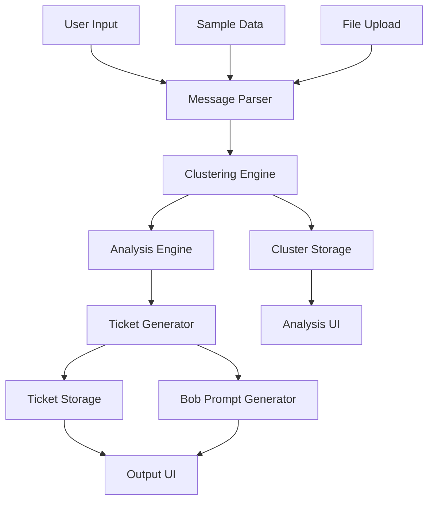
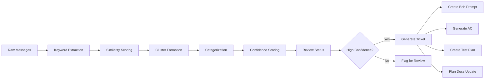
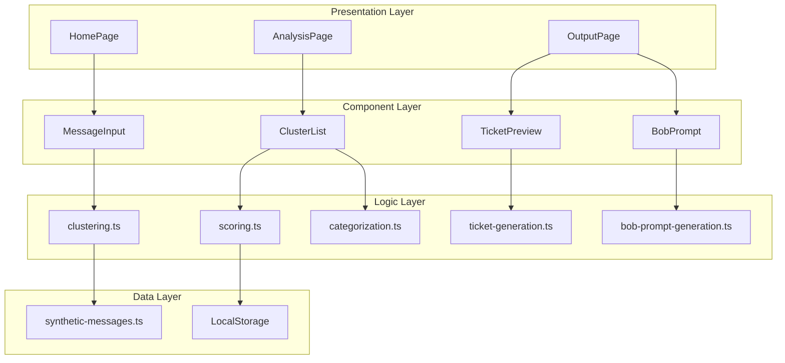
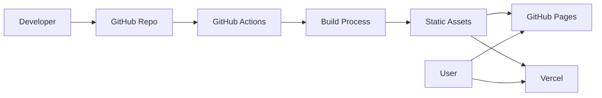

# Harmonia Architecture

## System Overview

Harmonia is a client-side web application that processes synthetic developer-support messages and transforms them into structured engineering artifacts.

## High-Level Architecture



## Data Flow



## Component Architecture



## Core Processing Pipeline

### 1. Message Ingestion
- User pastes messages or loads sample data
- Messages parsed into structured format
- Timestamps and metadata extracted

### 2. Clustering
- Keyword extraction using TF-IDF-like approach
- Similarity calculation between messages
- Cluster formation based on similarity threshold
- Minimum cluster size: 3 messages

### 3. Analysis
- Category detection based on keyword patterns
- Severity assignment based on frequency and keywords
- Confidence scoring based on:
  - Message count in cluster
  - Keyword consistency
  - Evidence strength
  - Temporal clustering

### 4. Review Routing
- High confidence (>75%) → Ready for Bob
- Medium confidence (50-75%) → Needs human review
- Low confidence (<50%) → Insufficient signal

### 5. Ticket Generation
- Title generation from cluster summary
- Evidence extraction from key messages
- Affected files inference from keywords
- Acceptance criteria generation
- Test plan creation
- Documentation update plan

### 6. Bob Prompt Creation
- Context assembly from cluster data
- Task formulation for Bob IDE
- Constraint specification
- Expected output definition

## Technology Stack Details

### Frontend Framework
- **React 18+** with functional components and hooks
- **TypeScript** for type safety
- **Vite** for fast development and optimized builds

### Styling
- **Tailwind CSS** for utility-first styling
- **Headless UI** for accessible components
- Custom design tokens for consistency

### State Management
- React Context API for global state
- Local component state for UI interactions
- LocalStorage for persistence

### Routing
- Simple state-based navigation (no router library needed)
- Three main views: Home, Analysis, Output

### Build and Deploy
- Vite build system
- GitHub Pages or Vercel hosting
- GitHub Actions for CI/CD

## Data Models

### Message Processing
```typescript
// Input: Raw text messages
// Output: Structured Message objects with keywords

const processMessages = (raw: string): Message[] => {
  // Parse text into individual messages
  // Extract keywords
  // Assign metadata
  return messages;
};
```

### Clustering Algorithm
```typescript
// Input: Array of Message objects
// Output: Array of Cluster objects

const detectClusters = (messages: Message[]): Cluster[] => {
  // Calculate keyword vectors
  // Compute similarity matrix
  // Form clusters using threshold
  // Assign metadata to clusters
  return clusters;
};
```

### Confidence Scoring
```typescript
// Input: Cluster object
// Output: Confidence score (0-100)

const calculateConfidence = (cluster: Cluster): number => {
  // Message count factor
  // Keyword consistency factor
  // Evidence strength factor
  // Temporal clustering factor
  return score;
};
```

## Security and Compliance

### Data Handling
- All processing happens client-side
- No data sent to external servers
- No API keys or credentials required
- LocalStorage only for user convenience

### Synthetic Data Policy
- Only synthetic English-language messages
- No real user data, PII, or confidential information
- Dataset creation documented
- Compliance review before submission

## Performance Considerations

### Optimization Strategies
- Lazy loading of components
- Memoization of expensive calculations
- Debounced input handling
- Virtual scrolling for large message lists (if needed)

### Scalability Limits
- Client-side processing limits: ~1000 messages
- Cluster limit: ~50 clusters
- This is a proof-of-concept, not production-scale

## Future Enhancements

### Beyond MVP
- Real-time message streaming
- Machine learning-based clustering
- Integration with issue trackers
- Multi-language support
- Team collaboration features
- Historical trend analysis

### Production Considerations
- Backend API for processing
- Database for persistence
- Authentication and authorization
- Rate limiting and quotas
- Monitoring and analytics

## IBM Bob IDE Integration

### Development Workflow
1. **Plan Mode** - Architecture and design decisions
2. **Code Mode** - Implementation of features
3. **Review Mode** - Code quality and refinement
4. **Ask Mode** - Technical questions and clarifications

### Bob Prompt Generation
The app generates Bob IDE prompts that include:
- Full cluster context
- Affected file analysis
- Implementation constraints
- Expected deliverables
- Testing requirements

### Session Export Strategy
- Export after each major milestone
- Include token usage screenshots
- Document Bob's contributions
- Store in `bob_sessions/` directory

## Deployment Architecture



## Error Handling

### User Input Errors
- Empty message input
- Invalid JSON upload
- Malformed data

### Processing Errors
- Insufficient messages for clustering
- No clusters detected
- Low confidence across all clusters

### UI Error States
- Loading indicators
- Error messages with recovery actions
- Fallback UI for edge cases

## Testing Strategy

### Unit Tests
- Clustering algorithm
- Confidence scoring
- Category detection
- Ticket generation

### Integration Tests
- Full pipeline: messages → ticket
- Sample data processing
- Export functionality

### Manual Tests
- UI responsiveness
- Cross-browser compatibility
- Demo flow validation

---

This architecture supports the hackathon goals of clarity, demo value, and rapid development while maintaining code quality and compliance standards.